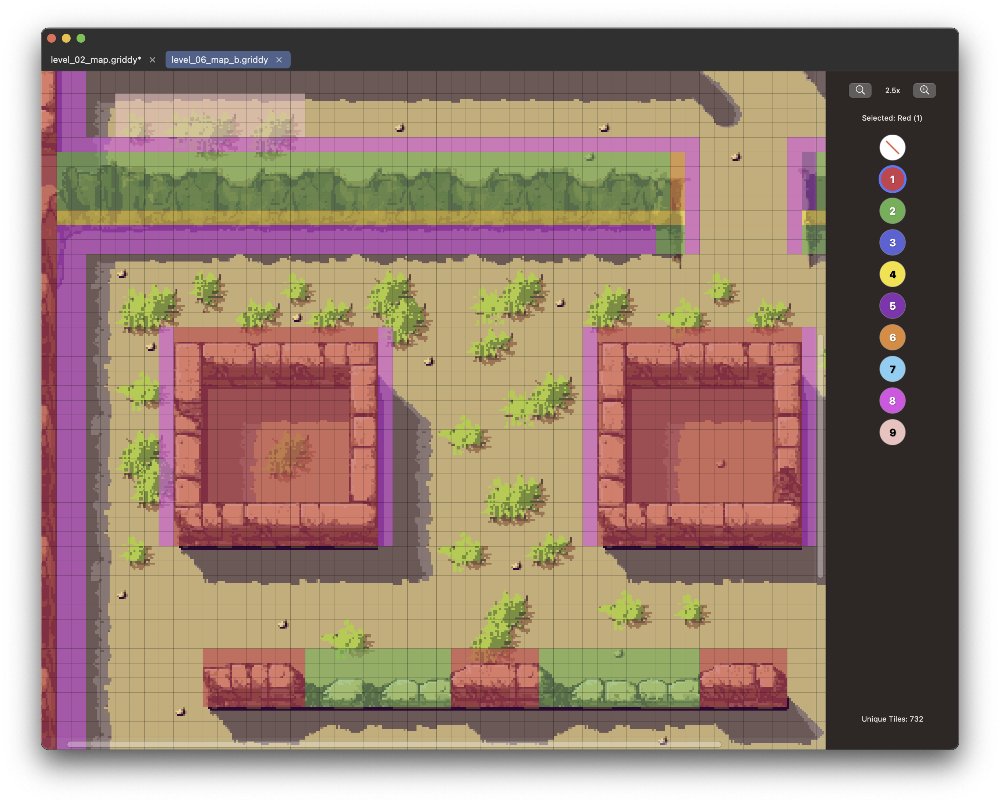

//
//  README.md
//  Griddy
//
//  Created by Thomas Minzenmay on 20.04.25. 
//

# Griddy - Tile Mapper

## A Simple macOS Tool for Creating Collision and Tile Property Maps

 

 

Griddy is a straightforward macOS application designed specifically for **Sega Mega Drive / Genesis developers** (and potentially other retro platforms) who need to visually create data maps based on image layouts. It excels at generating **collision maps** or defining areas with specific **tile properties**.

It works by overlaying an 8x8 pixel grid onto a PNG image (like a level map background) and allowing you to "paint" values (0-9) onto each grid cell. The resulting numerical grid data can be easily exported to various formats suitable for direct integration into your Mega Drive C or assembly code arrays.

## Features

*   **Open PNG Files:** Opens standard PNG images. **(Crucial: Image dimensions must be exact multiples of 8 pixels)**.
*   **8x8 Grid Overlay:** Automatically places a visual 8x8 grid, matching the tile size commonly used on the Mega Drive.
*   **Tile Value Painting:**
    *   Select from 9 distinct values/colors (numbered 1-9) plus a "No Value" option (0).
    *   Click a grid cell to assign the selected value.
    *   Click and drag to assign the selected value to rectangular areas.
    *   Use the "No Value" tool (index 0) to clear values from cells (sets them to 0).
    *   Painted cells are semi-transparent, allowing the underlying map image to remain visible.
*   **Multiple Document Tabs:** Open and work on multiple map images simultaneously.
*   **Zoom & Pan:** Easily navigate large maps using pinch-to-zoom or toolbar buttons, and pan with trackpad/mouse scrolling.
*   **Drag & Drop:** Quickly open `.png` or `.griddy` project files by dragging them onto the app window or Dock icon.
*   **Project Saving (.griddy):** Save your work (base image + assigned grid values) into a custom `.griddy` project file.
*   **Data Export Formats:**
    *   **C Header/Source Export:** Directly export the grid data as `const u16 arrayName[ROWS][COLS]` into `.c` and `.h` files, ready for SGDK (or similar C-based dev kits). Includes basic header guards. You choose the base name for the files and the array variable. 
    *   **CSV Export/Import:** Export the numerical grid data (0-9) as a **comma-separated** CSV file. Import grid data from a **comma- or semicolon-separated** CSV file (dimensions must match the current image's grid). 
*   **Interface:**
    *   Clean, native macOS look using SwiftUI.

## Installation

**1. Pre-built Application (Recommended):**

*   Go to the **[Releases](https://github.com/mintho/Griddy/releases)** page of this repository. 
*   Download the latest `Griddy_vX.Y.Z.zip`.
*   Unzip and drag `Griddy.app` to your `/Applications` folder.
*   **First Launch:** Right-click `Griddy.app` -> "Open" -> Confirm "Open" in the dialog. (This may be required due to macOS Gatekeeper).

**2. Building from Source:**

*   **Prerequisites:** macOS 14.0+, Xcode 15.0+, Git.
*   **Steps:**
    1.  `git clone https://github.com/mintho/Griddy.git`
    2.  `cd Griddy`
    3.  Open `Griddy.xcodeproj` in Xcode.
    4.  Select the `Griddy` scheme and "My Mac".
    5.  Build & Run (Cmd+R).

## How to Use

1.  **Launch Griddy.**
2.  **Open Map Image:** Use `File > Open PNG...` (Cmd+O) or drag a PNG onto the app. Remember: **Dimensions must be multiples of 8!**
3.  **Painting Values:**
    *   Use the **Toolbar** on the right.
    *   Click a **Color Circle (1-9)** to select a value to paint.
    *   Click the **White Circle with Red Slash (0)** to select the "No Value" / erase tool.
    *   **Click** on a grid cell in the image area to assign the selected value.
    *   **Click and Drag** to assign the value to a rectangular area.
    *   Use `Edit > Undo` (Cmd+Z) and `Edit > Redo` (Cmd+Shift+Z) as needed.
4.  **Navigation:** Use the **Zoom Buttons** (+/-) in the toolbar or **Pinch-to-Zoom** on the image. **Pan** using two-finger scroll (trackpad) or mouse scroll/drag.
5.  **Saving/Loading Project:**
    *   Use `File > Save Project` (Cmd+S) or `Save Project As...` (Cmd+Shift+S) to save the image and grid data together in a `.griddy` file.
    *   Use `File > Open Project...` (Cmd+Shift+O) or drag-and-drop to load a `.griddy` file.
6.  **Exporting for Mega Drive / Genesis:**
    *   **Option A (Recommended for C): Export C/H Source** (`File > Export C/H Source...`, Cmd+E)
        *   Choose a directory and provide a base name (e.g., `level1_map`).
        *   This generates `level1_map.c` and `level1_map.h`.
        *   The `.c` file contains `const u16 LEVEL1_MAP[HEIGHT][WIDTH] = { {0,0,1,...}, ... };`
        *   The `.h` file contains the `extern const u16 ...` declaration and includes `<genesis.h>`.
        *   The array name is automatically uppercased from your base name.
    *   **Option B: Export CSV** (`File > Export CSV...`, Cmd+Shift+E)
        *   Saves a standard CSV file (values separated by commas).
        *   You can parse this manually or use scripts to convert it into the array format needed by your specific toolchain (e.g., for assembly).
7.  **Importing Data:**
    *   **Import C Source:** (`File > Import C Source...`, Cmd+I) - Select a `.c` file previously exported by Griddy (or one following the exact `const u16 name[rows][cols] = { ... };` format). Grid data will be loaded. *Dimensions must match the current image.*
    *   **Import CSV:** (`File > Import CSV...`, Cmd+Shift+I) - Select a `.csv` file (comma or semicolon separated). Grid data will be loaded. *Dimensions must match the current image.*
8.  **Tabs:** Open multiple files via the menu or drag-and-drop. Use the tab bar at the top to switch files. Click the 'x' on a tab or use Cmd+W / `File > Close Tab` to close the current tab. You will be prompted to save if there are unsaved changes.

## File Formats

*   **`.griddy`:** Native JSON project file containing the original PNG image data and the current grid data array.
*   **`.c` / `.h`:** Standard C source and header files containing the grid data as a `const u16` 2D array, suitable for SGDK.
*   **`.csv`:** Comma-separated values (0-9) representing the grid, row by row.

## License

This project is licensed under the MIT License. See the [LICENSE](LICENSE) file for details.

